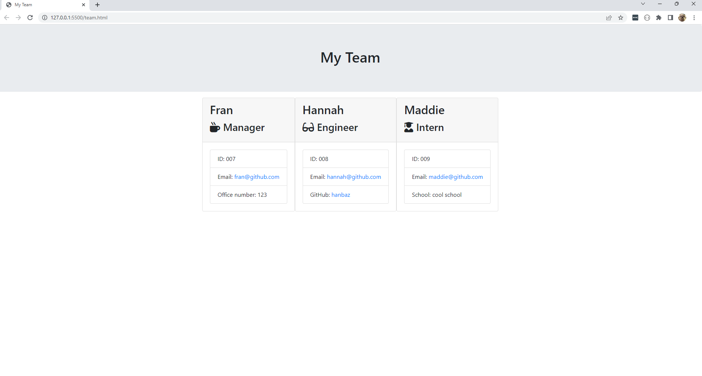

# show-my-team-OOP

## USER STORY

> As a manager I want to generate a webpage that displays my team's basic info so that I can have quick access to their emails and GitHub profiles.

## DESCRIPTION

A command-line application that allows the user to answer prompts relating to team members and renders that information to an HTML file to display information about the team. The application can be used by a manager in any team or organization to create profiles on each of their team members.

## USAGE

To use the application, the user must have node.js and npm installed on their machine. When they run `node index.js` they will be shown prompts relating to the manager, asking for details such as their name, id and email. They can then decide whether to add further team members such as an engineer and intern, or to finish. Once all the desired information has bbbeen entered, an HTML file will be generated and can be opened in a browser to view the team profiles.

## SCRRENSHOTS

## LICENCE
Please refer to the licence in the repository
  